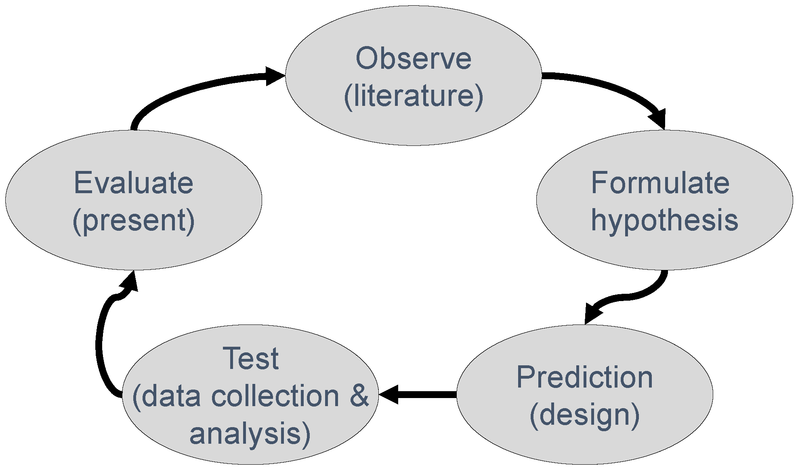
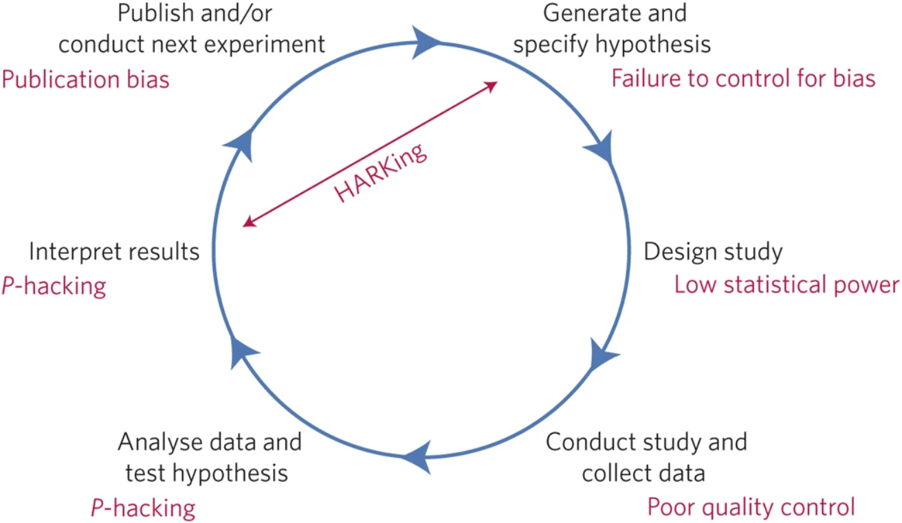

# science_fika_talk

My talk for [Science Fika](https://www.sciencefika.se/) in Uppsala.

It will be given at 2023-01-29.

## Publicity

Title:
 * EN: Open Science and scientists being humans
 * SV: Open Science och forskare som är människa

Language: English

Description in EN:

Open Science is a way to do science that is more reproducible, effective and inclusive. Since 2016, the European Union sees Open Science as the best method of doing research. This talk discusses what Open Science is and why it is important, touching upon the prevalence of dubious research practices and its causes. Spoiler: even scientists are only human.

Description in SV:

Open Science är ett sätt att göra vetenskap som är mer reproducerbar, effektiv och inkluderande. Sedan 2016 ser Europeiska unionen Open Science som den bästa metoden att forska på. Detta föredrag diskuterar vad Open Science är och varför det är viktigt, och berör förekomsten av tvivelaktiga forskningsmetoder och dess orsaker. Spoiler: även forskare är bara människor.

## Talk

### What is science?

> The classical model of doing science, picture from [Wicherts, 2017]

> From [Munafò et al., 2017]

Problems

 * HARK
 * p-value hacking

## How often do scientists do this?

## Why do scientists do this?

# What is Open Science?

# EU

# Pre-registration in clinical trials

## References

 * [Gopalakrishna et al, 2022] Gopalakrishna, Gowri, et al. "Prevalence of questionable research practices, research misconduct and their potential explanatory factors: A survey among academic researchers in The Netherlands." PloS one 17.2 (2022): e0263023.

 * [Munafò et al., 2017] Munafò, Marcus R., et al. "A manifesto for reproducible science." Nature human behaviour 1.1 (2017): 1-9.

 * [Wicherts et al., 2016] Wicherts, Jelte M., et al. "Degrees of freedom in planning, running, analyzing, and reporting psychological studies: A checklist to avoid p-hacking." Frontiers in psychology (2016): 1832.

 * [Wicherts, 2017] Wicherts, Jelte M. "The weak spots in contemporary science (and how to fix them)." Animals 7.12 (2017): 90.

